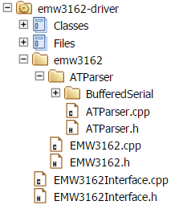
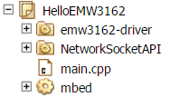

# Porting Guide For EMW3162 WIFI Module
How to add EMW3162 WIFI module support to NSAPI

The network-socket API ([NSAPI](https://docs.mbed.com/docs/mbed-os-api-reference/en/5.2/APIs/communication/network_sockets/)) provides a common interface for using sockets on network devices. It’s a class-based interface, which should be familiar to users experienced with other socket APIs. Here’s the porting guide that provides you an example to add a WIFI module (EMW3162) support to NSAPI.

You can find the source code here:

- [EMW3162 driver](https://developer.mbed.org/users/Maggie17/code/emw3162-driver/)
- [Example project using emw3162-driver and NSAPI](https://developer.mbed.org/users/Maggie17/code/HelloEMW3162/)

## 1 Framework Reference
Here we use the framework inheriting from the [ESP8266 driver](https://github.com/armmbed/esp8266-driver), both of which support the AT command via UART to implement the communication between the module and board, shown as below:


       
- `BufferSerial dir`: Software Buffer, mainly extend mbed Serial functionallity adding irq driven TX and RX.
- `ATParser.cpp / ATParser.h`: Parser for the AT command syntax
- `EMW3162.cpp / EMW3162.h`: EMW3162Interface class, provide an interface to a EMW3162 radio.
- `EMW3162Interface.cpp / EMW3162Interface.h`: EMW3162Interface class, implementation of the NetworkStack for the EMW3162

Usually, when add a new WIFI module using the above framework, we just need rewrite the EMW3162 interface file (including EMW3162.cpp / EMW3162.h and EMW3162Interface.cpp / EMW3162Interface.h) and might modify the AT parser file (including ATParser.cpp / ATParser.h) slightly according to the format difference of AT command RX & TX in different WIFI modules.

## 2 API Implementation
Here we just port the functions on client side.
### 2.1 EMW3162Interface.cpp / EMW3162Interface.h
In these two files, we need port the APIs both in WIFI Connection and Socket Management (including TCP and UDP connection). Refer to the source code ([here](https://developer.mbed.org/users/Maggie17/code/emw3162-driver/)), this high level API inherits from NetworkStack and WifiInterface. So the class HAS TO implement the WifiInterface and NetworkStack virtual methods.

Let's grab the function *virtual const char \*get_ip_address()* for an example. It is declared in *NetworkStack*, but implemented in *EMW3162Interface*, and call submodule *EMW3162* to send the corresponding AT command. In this case, "AT+IPCONFIG" is sent to get the internally stored IP address. *EMW3162* is also responsible for parsing the received data and return it back to upper layer *EMW3162Interface*. The *ATParser* offers all the parser API for *EMW3162*, including parser for the data to be sent and receviced. The *BufferedSerial* is responsible for sending data out to module through UART and handling received data once interrupt signal is detected and send it back to *ATParser*. 


WifiInterface API ([Implementation details](https://docs.mbed.com/docs/mbed-os-api-reference/en/5.2/APIs/communication/wifi/))
```
- EMW3162Interface: define the EMW3162 Interface class.
- connect: start the interface, attempt to connect to a WiFi network.
- disconnect: Stop the interface.
- *get_ip_address:get the internally stored IP address.
- *get_mac_address:get the internally stored MAC address.
```
NetworkStack API ([Implementation details](https://docs.mbed.com/docs/mbed-os-api/en/mbed-os-5.2/api/classNetworkStack.html/))
```
- socket_open: open a socket.
- socket_close: close a socket.
- socket_connect: connect the TCP socket to a server with the specified socket address.
- socket_send: send data to the remote host when in TCP connection.
- socket_recv: receive data from the remote host when in TCP connection.
- socket_sendto: send data to a remote host with the specified address when in UDP connection.
- socket_recvfrom: receive data from a remote host with the specified address when in UDP connection.
- socket_attach: register a callback on state change of the socket.
```
Please refer to the [source code](https://developer.mbed.org/users/Maggie17/code/emw3162-driver/file/fb6251306b21/EMW3162Interface.cpp) for details.

### 2.2 EMW3162.cpp / EMW3162.h
These two files mainly implement all the detail functions for the above APIs using the parser interface from ATParser module. It is the most key part in the porting process as details implementation of different WIFI module are quite different, thus nearly all the code need be rewritten. 

We can get all the AT commands for EMW3162 [here](http://www.mxchip.com/download/getFiles/578eed8d253ad.pdf).

For details, please refer to the [source code](https://developer.mbed.org/users/Maggie17/code/emw3162-driver/file/fb6251306b21/emw3162/EMW3162.cpp).

### 2.3 ATParser.cpp / ATParser.h
In EMW3162, format of data to be sent is a bit different from ESP8266 (<CR> need be added to the end in EMW 3162 while ESP 8266 needn’t). We add the following code to “ATParser::vsend” function after all the data have been sent out.
```
/* Finish with <CR> */
char s[] = "\x0d";
for (int i = 0; s[i]; i++){
    if(putc(s[i]) < 0)
        printf("send <CR> error\n");
}
``` 
## 3 Target Setting / Module Using
When using the emw3162 module, the project (HelloEMW3162) must include the emw3162-driver library, NetworkSocketAPI library, mbed library and main.cpp:


       
In main.cpp, we need add the following code to define the WIFI interface:
```
#include "EMW3162Interface.h"

EMW3162Interface wifi(D1, D0);    // D1 / D0 here refers to the UART TX / RX interface on the board
```

Thus the EMW3162 driver should work!
